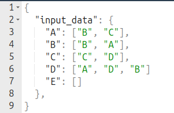
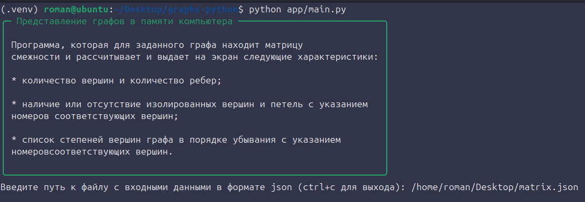
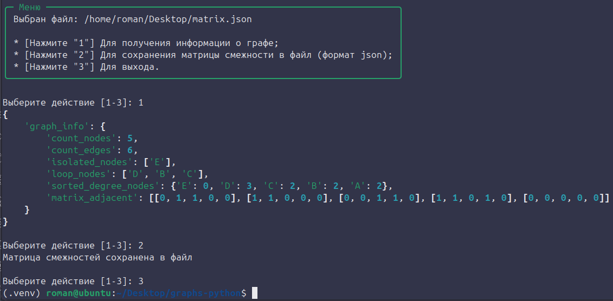
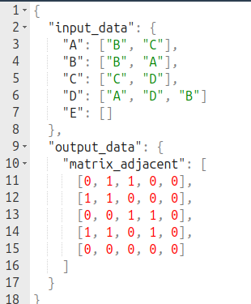

<h3>Тема: Представление графов в памяти компьютера</h3>

**Формулировка задания**: написать программу, которая для заданного неориентированного
графа находит матрицу смежности и рассчитывает и выдает на экран следующие
характеристики:
1) количество вершин и количество ребер;
2) наличие или отсутствие изолированных вершин и петель c указанием номеров
соответствующих вершин;
3) список степеней вершин графа в порядке убывания с указанием номеров
соответствующих вершин.

**Входные данные**: представление неориентированного графа в виде списков смежности,
хранящееся в текстовом файле (структура файла определяется разработчиком).

**Выходные данные**: представление графа в виде матрицы смежности записывается в конец
файла с входными данными.

<h3>Процесс установки </h3>

```
git clone https://github.com/RomesAll/graphs-python.git
cd graphs-python
python3 -m venv venv
source /venv/bin/activate
pip install -r requirements.txt
python app/main.py
```

<h3>Демонстрация работы</h3>
1. Пример файла с входными данными в формате json



2. Выполнение программы в консоли




3. Пример файла с входными и выходными данными в формате json


